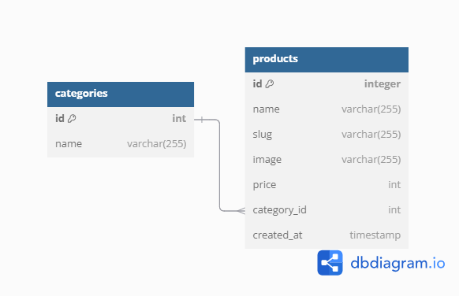
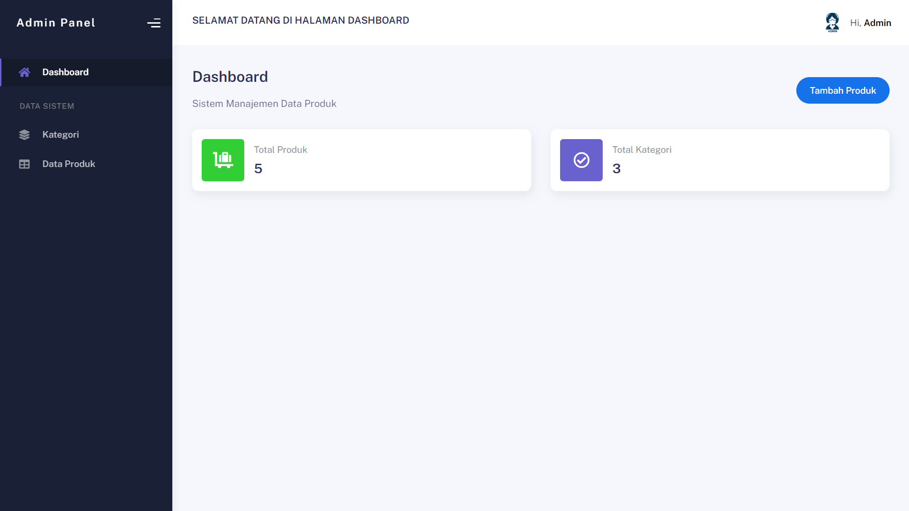
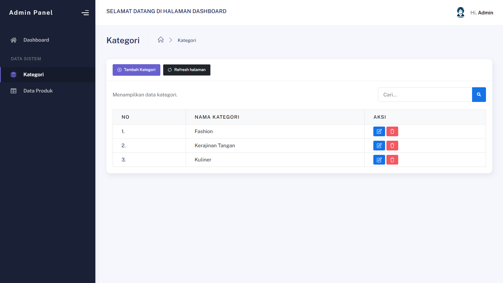
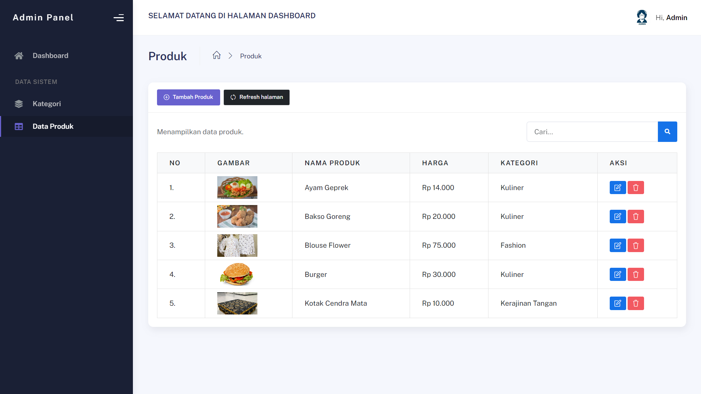

# Admin Panel Project

## Deskripsi
Project ini merupakan admin panel untuk manajemen produk dengan relasi one-to-many.

## Database Design

## Screenshot

## Dependencies
- Laravel 8
- Bootstrap 5
- SweetAlert

## Informasi Lain
Untuk menjalankan project ini:
1. Clone repository
2. Jalankan `composer install`
3. Jalankan migration dengan `php artisan migrate`
4. Jalankan `php artisan storage:link`
5. Jalankan `php artisan serve`
